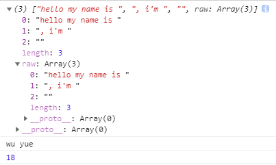

<!-- TOC -->

- [TS数据类型](#ts数据类型)
    - [基础数据类型](#基础数据类型)
        - [布尔值](#布尔值)
        - [数字](#数字)
        - [字符串新特性](#字符串新特性)
        - [自动拆分字符串](#自动拆分字符串)
        - [数组](#数组)
        - [元组](#元组)
        - [枚举](#枚举)
        - [`any`](#any)
        - [`Void`](#void)
        - [`null`和`undefined`](#null和undefined)
        - [`Never`](#never)
        - [类型断言](#类型断言)

<!-- /TOC -->

# TS数据类型

## 基础数据类型

`TS`支持与`JS`几乎相同的数据类型：数字、字符串、结构体、布尔值等，还提供了枚举类型。

### 布尔值

定义一个布尔类型的变量：

`let isDone: boolean = false;`

语法：

`let 变量名 ： 数据类型`

### 数字

**TS中所有数字都是浮点数（number）**，除了支持十进制和十六进制字面量，`TS`还支持`ES6`中引进的二进制和八进制字面量。

二进制：`hexLiteral`，八进制：`octalLiteral`，十进制：`decLiteral`，十六进制：`binaryLiteral`

```typescript
let decLiteral: number = 6;  // 十进制
let hexLiteral: number = 0xf00d;  // 二进制
let binaryLiteral: number = 0b1010;  //  十六进制
let octalLiteral: number = 0o744;  // 八进制
```

**类型推断机制**：

`TypeScript` 中如果你先给一个变量赋值为字符串, 然后再将这个变量赋值一个数字, `TypeScript`就会报错因为`TypeScript`拥有类型推断机制,会推断该变量为字符串类型.

### 字符串新特性

单行字符串：`let my: string = 'wuyue';`

多行字符串：在TS中使用 `反引号` (``)表示多行字符串。

```typescript
let my: string = `my name
is wuyue`;
```

内嵌表达式：使用 `${param}`来潜入表达式

例如：

```typescript
let myName: string = 'wuyue';
let myAge: number = 22;
let my: string = `Hello, my name is ${myName}.
I'll be ${myAge + 1} years old.`
```
与下方例子等同：

```typescript
let my: string = 'Hello, my name is ' + myName + '.\n' + "I'll be " + (myAge + 1) + ' years old.'
```

### 自动拆分字符串

例如，在`ts`文件中输入：

```typescript
function userinfo(param, name, age) {
    console.log(param);
    console.log(name);
    console.log(age);
}
let myname = 'wu yue';
let getAge = function() {
    return 18;
}
userinfo`hello my name is ${myname}, i'm ${getAge()}`
```

编译后，`js`文件内容为：

```javascript
var __makeTemplateObject = (this && this.__makeTemplateObject) || function (cooked, raw) {
    if (Object.defineProperty) { Object.defineProperty(cooked, "raw", { value: raw }); } else { cooked.raw = raw; }
    return cooked;
};
function userinfo(param, name, age) {
    console.log(param);
    console.log(name);
    console.log(age);
}
var myname = 'wu yue';
var getAge = function () {
    return 18;
};
userinfo(__makeTemplateObject(["hello my name is ", ", i'm ", ""], ["hello my name is ", ", i'm ", ""]), myname, getAge());
```

在`html`页面中：



### 数组

`TS`有两种方式可以定义数组：

在元素类型后面加上`'[]'`，表示由此类型元素组成的一个数组；

```typescript
let list: number[] = [1, 2, 3];  // ts
var list = [1, 2, 3]; // js
```

使用数组泛型，`Array<元素类型>`

```typescript
let list2: Array<number> = [4, 5, 6];  // ts
var list2 = [4, 5, 6]; // js
```

### 元组

元组类型允许表示一个已知元素数量和类型的数组，各元素的类型不必相同：

```typescript
// 声明一个元组类型
let x: [string, number];
// 初始化元组
x = ['hello', 10];
x = [10, 'hello']; // 这里会报错:类型错误
```

### 枚举

`enum`类型是对JS标准数据类型的一个补充。

```typescript
enum Color {Red, Green, Blue}
let c: Color = Color.Green;
```

默认情况下，从0开始为元素编号，也可以手动指定成员的数值。

```typescript
enum Color {Red = 1, Green, Blue}
let c: Color = Color.Green;
```

或者全部采用手动赋值

```typescript
enum Color {Red = 1, Green = 2, Blue = 4}
let c: Color = Color.Green;
```

枚举类型提供的一个便利是你可以由枚举的值得到它的名字。 例如，我们知道数值为2，但是不确定它映射到`Color`里的哪个名字，我们可以查找相应的名字：

```typescript
enum Color {Red = 1, Green, Blue}
let colorName: string = Color[2];
alert(colorName);
```

### `any`

如果不希望类型检查器对值进行检查，直接通过编译阶段的检查，可以使用`any`类型来标记这些变量。

```typescript
let notSure: any = 4;
notSure = 'this is a string';
notSure = false;
```

`Object`只允许给他赋任意值，却不能调用任意方法。

```typescript
let notSure: any = 4;
notSure.ifItExists();// 存在这个方法
notSure.toFixed(); // 存在这个方法
let prettySure: Object = 4;
prettySure.toFixed(); // 错误：对象类型上不存在 toFixed 属性
```

包含不同类型的数据的数组：

```typescript
let list: any[] = [1, false, 'aaa'];
list[1] = 200;
```

### `Void`

`void`的类型像是与`any`类型相反，表示没有任何类型。当一个函数没有返回值时，通常会见到其返回值的类型为`void`。

```typescript
function warnUser(): void {
    alert('this is my warning message');
}
```

声明一个`void`没什么大用，只能给他赋予`undefined`和`null`两个值。

```typescript
let unusable: void = undefined;
```

### `null`和`undefined`

与`void`相似，声明他们本身的类型用处并不大：

```typescript
let u: undefined = undefined;
let n: null = null;
```

*默认情况下，`null`和`undefined`是所有类型的子类型。即，可以把`null`和`undefined`赋值为`number`类型。*

*如果在编译时指定了`strictNullChecks`标记，`null`和`undefined`只能赋值给`void`和他们自己。*

### `Never`

`never`表示的是那些永不存在的值的类型

例如：`never`类型是那些总会抛出异常或根本不会有返回值的函数表达式或箭头函数表达式的返回值类型。

`never`类型是任何类型的子类型，也可以复制给任何类型；然而，没有类型是`never`的字类型或可以复制给`never`类型（除了`never`本身）。即使`any`也不可以赋值给`never`。

下面是一些返回`never`类型的函数：

```typescript
// 返回never的函数必须存在无法达到的终点
function error(message: string): never {
    throw new Error(message);
}
// 推断的返回值类型为never
function fail() {
    return error('Something failed');
}
// 返回never的函数必须存在无法达到的终点
function infiniteLoop(): never {
    while(true) {}
}
```

### 类型断言

类型断言好比其他语言里的类型转换，但是不进行特殊数据检查和结构。它没有运行时的影响，只是在编译阶段起作用。

**类型断言有两种形式：尖括号法和`as`语法。**

尖括号法：

```typescript
let someValue: any = 'this is a string';
let strLength: number = (<string>someValue).length;
```

`as`语法：

```typescript
let someValue: any = 'this is a string';
let strLength: number = (someValue as string).length;
```

当在`TS`中使用`JSX`时，只有`as`语法断言是被允许的。
