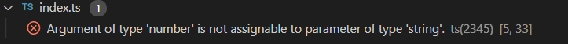

<!-- TOC -->

- [新建一个TS文件](#新建一个ts文件)
    - [创建一个TS文件](#创建一个ts文件)
    - [类型注解](#类型注解)
    - [接口](#接口)
    - [面向对象编程](#面向对象编程)
    - [运行](#运行)

<!-- /TOC -->

# 新建一个TS文件

## 创建一个TS文件

先创建一个名为`'hello.ts'`的文件，文件内容为：

```Typescript
function hello(name: string) {
    return 'Hello, ' + name;
}
let username = 'Wu Yue';
document.body.innerHTML = hello(username);
```

然后编译：`tsc hello.ts`

结果生成一个`'hello.js'`的文件，文件内容为：

```javascript
function hello(name) {
    return 'Hello, ' + name;
}
var username = 'Wu Yue';
document.body.innerHTML = hello(username);
```

## 类型注解

TS里的类型注解是一种轻量级的为函数或变量添加的约束的方式

例如：约束`hello`函数接收字符串类型的参数。

```typescript
function hello(name: string) {

}
```

如果参数类型发生改变，会产生错误：



`TypeScript`提供了静态的代码分析，它可以分析代码结构和提供的类型注解。

## 接口

可以使用借口来描述一个拥有`firstName`和`lastName`字段的对象

在TS中，只要两个类型内部的结构兼容那么这两个类型就是兼容的。

代码示例：

```typescript
interface Person {
    firstName: string,
    lastName: string
}
function hello(person: Person) {
    return 'Hello, ' + person.firstName + ' ' + person.lastName;
}
let userName = {
    firstName: 'Wu',
    lastName: 'Yue'
}
document.body.innerHTML = hello(userName);
```

编译完成之后的js文件：

```javascript
function hello(person) {
    return 'Hello, ' + person.firstName + ' ' + person.lastName;
}
var userName = {
    firstName: 'Wu',
    lastName: 'Yue'
};
document.body.innerHTML = hello(userName);
```

TS的类型检查是在编译时完成的。

## 面向对象编程

TS支持JS的新特性，比如支持基于类的面向对象编程

例如：创建一个Student类，它带有一个构造函数和一些公开字段。（类和接口可以一起工作）

在构造函数的参数上使用public等同于创建了同名的成员变量。

代码示例：

```typescript
class Student {
    fullName: string;
    constructor(public firstName, public middleInitial, public lastName) {
        this.fullName = firstName + ' ' + middleInitial + ' ' + lastName;
    }
}
interface Person {
    firstName: string,
    lastName: string
}
function hello(person: Person) {
    return 'Hello, ' + person.firstName + ' ' + person.lastName;
}
let user = new Student('Wu', 'D.', 'Yue');
document.body.innerHTML = hello(user);
```

编译完成之后生成的js文件内容：

```javascript
var Student = /** @class */ (function () {
    function Student(firstName, middleInitial, lastName) {
        this.firstName = firstName;
        this.middleInitial = middleInitial;
        this.lastName = lastName;
        this.fullName = firstName + ' ' + middleInitial + ' ' + lastName;
    }
    return Student;
}());
function hello(person) {
    return 'Hello, ' + person.firstName + ' ' + person.lastName;
}
var user = new Student('Wu', 'D.', 'Yue');
document.body.innerHTML = hello(user);
```

## 运行

在`hello.ts`所在的文件夹建一个`hello.html`，`html`内容如下：

```html
<!DOCTYPE html>
<html lang="en">
<head>
    <meta charset="UTF-8">
    <meta name="viewport" content="width=device-width, initial-scale=1.0">
    <title>hello TS</title>
</head>
<body>
    <script src="index.js"></script>
</body>
</html>
```