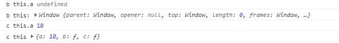

<!-- TOC -->

- [`TS`函数](#ts函数)
    - [函数类型](#函数类型)
    - [函数参数](#函数参数)
        - [必须参数](#必须参数)
        - [可选参数](#可选参数)
        - [默认参数](#默认参数)
        - [剩余参数](#剩余参数)
    - [箭头函数](#箭头函数)
        - [表现形式一](#表现形式一)
        - [表达形式二](#表达形式二)
    - [箭头函数的`this`](#箭头函数的this)
    - [函数重载](#函数重载)
        - [`JS`重载](#js重载)
        - [`TS`重载](#ts重载)

<!-- /TOC -->

# `TS`函数

和`JS`一样，`TS`即可创建有名字的函数，也可创建匿名函数。

```typescript
function add(a, b) {
    return a + b;
}
let add1 = function (a, b) {
    return a + b;
}
```

## 函数类型

为函数定义类型，可以为函数本身添加返回值类型。

`函数（）：类型 {}`

例如：

```typescript
function add(a, b) {
    return a + b;
}
let add1 = function (a, b) {
    return a + b;
}
```

## 函数参数

### 必须参数

`TS`里的每个函数参数都是必须的。传递给一个函数的参数个数必须与函数期望的参数个数一致。

```typescript
function buildName(firstName: string, lastName: string) {
    return firstName + " " + lastName;
}
// error, Expected 2 arguments, but got 1.
let result1 = buildName("Bob");
// error, Expected 2 arguments, but got 3.
let result2 = buildName("Bob", "Adams", "Sr.");
// 这种方式是正确的
let result3 = buildName("Bob", "Adams");
```

### 可选参数

在TS里可以在参数名旁使用`？`实现可选参数的功能。

例如：让`lastName`可选

```typescript
function buildName(firstName: string, lastName?: string) {
    return firstName + " " + lastName;
}
let result1 = buildName("Bob");
// error, Expected 1-2 arguments, but got 3.
let result2 = buildName("Bob", "Adams", "Sr.");
// 这种方式是正确的
let result3 = buildName("Bob", "Adams");
```

**注意：可选参数必须跟在必须参数的后面。**

### 默认参数

在`TS`里。也可以为参数提供一个默认值。

例如：将`lastName`的默认值设置为`Smith`

```typescript
function buildName(firstName: string, lastName = 'Smith') {
    return firstName + " " + lastName;
}
let result1 = buildName("Bob");
// error, Expected 1-2 arguments, but got 3.
let result2 = buildName("Bob", "Adams", "Sr.");
// 这种方式是正确的
let result3 = buildName("Bob", "Adams");
```

### 剩余参数

在`JS`中使用`arguments`来访问所有传入的参数。但在`TS`中，可以使用`…`变量名把所有的参数收集到一个变量里。

```typescript
function buildName(firstName: string, ...restOfName: string[]) {
    return firstName + " " + restOfName.join(' ');
}
let result1 = buildName("Bob");
let result2 = buildName("Bob", "Adams", "Sr.");
let result3 = buildName("Bob", "Adams");
```

剩余参数会被当作个数不限的可选参数。可以一个都没有，同样也可以有任意个。

## 箭头函数

箭头函数相当于匿名函数，简化了函数定义。

### 表现形式一

包含一个表达式，连`{…}`和`return`都省略掉了。

```typescript
x => x * x;
// 等同于
function (x) {
    return x * x;
}
```

### 表达形式二

包含多条语句，这是就不能省略`{…}`和`return`

```typescript
x => {
    if(x > 0) {
        return x * x;
    } else {
        return - x * x;
    }
}
```

## 箭头函数的`this`

箭头函数的引入有两个方面的作用。

1. 更简短的函数书写
2. 对`this`的语法解析

普通函数：`this`指向调用它的那个对象

箭头函数：不绑定`this`，会捕获其所在的上下文的`this`值，作为自己的`this`值，任何方法都改变不了其指向，如`call()`，`bind()`,`apply()`

```typescript
var obj = {
    a: 10,
    b: () => {
        console.log('b this.a', this.a);
        console.log('b this:', this);
    },
    c: function () {
        console.log('c this.a', this.a);
        console.log('c this', this);
    }
}
obj.b();
obj.c();
```

运行结果：



## 函数重载

函数重载就是同一个函数，根据传递的参数不同，会有不同的表现形式。

### `JS`重载

`JS`本身是没有重载这个概念，但是可以模拟实现，例如：

```typescript
function func() {
    if (arguments.length == 0) {
        alert('欢迎来到w3cschool');
    } else if (arguments.length == 1) {
    alert(arguments[0]；
    }
}
func();
func(2);
```

利用`arguments`对象来判断传递参数的数量，然后执行不同的代码。

### `TS`重载
`TS`提供重载功能，`TS`的函数重载只有一个函数体。也就是说，无论声明多少个同名且不同签名的函数，他们只共享一个函数体，在调用时会根据传递实参类型的不同，利用流程控制语句、控制代码的执行。例如：

```typescript
// 定义两个重载
function func(x: string): string;
function func(x: number): number;
// 重载函数的共用函数体部分：
function func(x: any): any {
    if (typeof x == 'string') {
        return '欢迎来到XXXX';
    } else if (typeof x == 'number') {
        return 5;
    }
}
```

重载编译后的`js`代码：

```javascript
// 重载函数的共用函数体部分：
function func(x) {
    if (typeof x == 'string') {
        return '欢迎来到XXXX';
    }
    else if (typeof x == 'number') {
        return 5;
    }
}
```
